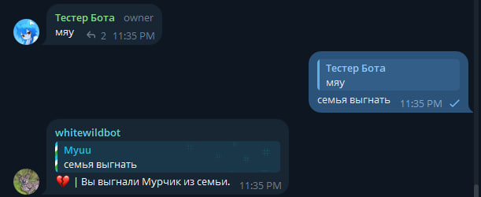

По просьбе Черника, я обновляю эту страничку. Пока-что обновлено не везде, но потом везде картинки доделаю.

## Команды **whitewildbot**

### Помощь
***
#### !help
Команда имеет несколько сокращений: *!help*, *помощь*, */start*
Выводит список команд.<br>
<br>

### Профиль
***
#### !setname (имя)
Это установит ваше имя в боте и то, как бот будет вас называть.
Без параметров имя будет установлено по умолчанию, как в вашем профиле Telegram.
Имя может быть установлено длиной до 90 символов.<br>
<br>

#### !setpronouns (местоимения)
Это установит ваши местоимения в боте, так же они могут повлиять то в каком поле бот будет к вам обращатся.
Без параметров местоимения будут удалены с вашего профиля.
Местоимения может быть установлены длиной до 30 символов.<br>
<br>

#### !setlocation (локация)
Это установит ваше местоположение в боте, это ни на что не влияет.
Без параметров локация будет удалена с вашего профиля.
Локация может быть установлена длиной до 240 символов.<br>
<br>

#### !setbirthday (мм.дд.гггг/день мес., год(только на англ.))
Это установит ваш день рождения в боте, это ни на что не влияет.
Без параметров ваш день рождение будет удален с вашего профиля.<br>
<br>

#### !setabout (Описание)
Это установит описание в ваш профиль в боте, это ни на что не влияет.
Без параметров ваше описание будет удалено с вашего профиля.
Описание может быть установлено длиной до 256 символов.<br>
<br>

#### !setpicture
Это установит картинку в ваш профиль в боте, это ни на что не влияет.
Чтобы установить картинку, нужно выбрать нужную картинку и отправить её вместе с командой.
Отправив команду без картинки, бот её удалит.<br>
<br>

#### !whois
Этой командой можно посмотреть профиль в боте свой или чей-то ответив на сообщение другого пользователя с этой командой.
Команда имеет несколько сокращений: *я*, *кто ты*, *кто я*<br>
<br>

#### !setchannel
Команда работает только в лс!
Если отправить команду когда у вас в профиле нет канала, бот попросит вас переслать сообщение из **публичного** канала телеграм.
После в вашем профиле появится канал который вы добавили.<br>
<br>

#### !verifyChannel
Для верефикации канала необходимо добавить бота в ваш канал.
После того как вы добавили бота в канал, напишите команду боту в лс и в вашем профиле появится галочка с подтверждением, что вы истинный администратор канала.

#### !addstickerset
Это установит стикер пак в ваш профиль в боте, это ни на что не влияет.
Чтобы установить стикер пак, нужно отправить любой стикер из стикер пака, и ответить командой на сообщение со стикером.
Отправив команду без ответа, бот удалит стикер пак с профиля.<br>
<br>

#### !setmusic
Это установит музыку в ваш профиль в боте, это ни на что не влияет.
Чтобы установить музыку, нужно отправить любую музыку, и ответить командой на сообщение с музыкой.
Отправив команду без ответа, бот удалит музыку с профиля.<br>
<br>

#### !family (<создать>/пригласить/выгнать/покинуть/распустить/принять) (<название>)
Команда имеет одно сокращение: *семья*<br>
<br>
Это семья. Она может вместить в себя до 15 участников одновременно.
Создать семью можно командой *семья создать <название>*.<br>
<br>
Отправить приглашение можно командой *семья пригласить* ответом на сообщение пользователя.<br>
<br>
Принять приглашение можно командой *семья принять*.<br>
<br>
Покинуть семью можно командой *семья покинуть*<br>
<br>
Так же лидер семьи может выгнать участников, командой *семья выгнать* ответив на сообщение пользователя.<br>
<br>
Чтобы удалить семью, используйте команду *семья распустить*.<br>
<br>

#### !setsteam [Ссылка на ваш аккаунт в стим]
После добавления, в вашем профиле в боте будет писать вот что вы играете в данный момент.<br>
<br>

### Модерация
***
#### !ban (время в секундах) (причина)
Команда сработает только в ответ на сообщение пользователя.
Записывает случай в наказания группы.
Команда имеет одно сокращение: *бан*

#### !mute (время в секундах) (причина)
Команда сработает только в ответ на сообщение пользователя.
Записывает случай в наказания группы.
Команда имеет одно сокращение: *мут*

#### !kick (причина)
Команда сработает только в ответ на сообщение пользователя.
Записывает случай в наказания группы.
Команда имеет одно сокращение: *кик*

#### !warn (причина)
Команда сработает только в ответ на сообщение пользователя.
Записывает случай в наказания группы.
Команда имеет одно сокращение: *варн*
Так же после достижения определённого количество предупреждений, бот будет выдавать реальные наказания:
* 3 предупреждения - мут 30 минут (пол часа).
* 4 предупреждения - мут 60 минут (1 час).
* 5 предупреждения - мут 120 минут (2 часа).
* 6 предупреждения - бан 1440 минут (24 часа).
* 7 предупреждения - бан 2880 минут (48 часов).
* 8 предупреждения - бан 10080 минут (1 неделя).
* 9 предупреждения - бан 43200 минут (1 месяц).
* 10 предупреждения - бан навсегда.

#### !punishments
Последние 5 наказаний в текущей группе
Команда имеет одно сокращение: *наказания*

#### !setrules (правила)
Устанавливает новые правила.

#### !addrules (правило)
Добавляет правило в уже существующие правила

#### !rules
Показывает правила чата.
Так же эта команда триггерится когда кто-то заходит в чат.
Команда имеет несколько сокращений: *правила*, */rules*

### Другое
***
#### шипперим
Шипперит двух участников группы

#### бот
Бот пишет техническую статистику, и это команда просто проверка работает ли бот сейчас.
Команда имеет одно сокращение: *аборт*

#### !askai
Можно пообщатся с ИИ от гугла (Gemini).
Команда имеет одно сокращение: *бот,*

#### афк
Можно встать в афк, после когда вы вернётесь бот напишет сколько вас не было.

#### !nsfw
По умолчанию во всех группых NSFW команды отключены.
Их можно включить с помощью этой команды.
Команда доступна только администраторам.

#### !rpcmds
Бот выдаст список доступных РП команд.
РП команды выполняются только в ответ на чьё-то сообщение.
Рп команды можно воспользоваться как: [команда] (уточнение) (фраза)
Например: *Погладить за ушком*
Вам никто не запрещает просто написать: *обнять* или *погладить* без уточнений или фразы.
Некоторые РП команды могут не работать из-за отключённого *!nsfw*
Команда имеет несколько сокращений: *рп*

#### !rp (group/группа)
Отключает РП команду для себя или для всей группы.
Для всей группы может отключить только администратор группы.

#### Брак (да/нет/убрать)
Ответив на чьё-то сообщение, можно сделать предложение о браке.
После ответа *брак да*, в вашем профиле и профиле вашего партнёра, появится ваш партнёр и вы.
Убрать брак можно командой: *брак убрать*

#### !rkn <доменное имя>
Можно увидеть список заблокированных сайтов Роскомнадзором по запросу.

#### !changelog (версия/флаги) (флаги)
Можно получить список изменений в боте, за конкретную версию или в текущий момент.
Команда имеет несколько сокращений: *!cl*, *изменения бота*

#### !advancements
Список ваших достижений в боте.
Ответив на чьё-то сообщение этой командой, можно увидеть достижения другого пользователя.
Команда имеет несколько сокращений: *ачивки*, *достижения*, *!adv*

#### !random (Мин. число) (Макс. число)
По умолчанию если не написать число, бот выберет от 1 до 100.

#### расшифруй
Пробует расшифровать не понятные сообщения.
Например если пользователь написал русский текст английскими буквами: *Ghbdtn dctv!*
Бот расшифрует как: *Привет всем!*

#### !rule34 (теги)
Бот отправит до 10 случайных картинок за раз с сайта rule34 по тегам.
Ограничение: Команду можно использовать 1 раз в минуту.
Команда работает только если включена команда !nsfw

#### !rule34nl (теги)
Бот отправит картинку с сайта rule34 по тегам.
Ограничение: Бот отправит только 1 картинку за раз. За то можно использовать сколько угодно раз в минуту.
Команда работает только если включена команда !nsfw

#### !exactrule34 (айди поста)
Бот отправит картинку с сайта rule34 по айди поста.
Если не указать айди, бот выберет случайное число.
Команда работает только если включена команда !nsfw

#### @everyone
Бот пинганёт всех в чате.

#### !google <запрос>
Бот поищет что нибуть в гугле

#### !transfer <сумма (в центах)>
Отправить конкретную сумму виртуальной валюты другому пользователю.
Команда выполняется только в ответ на чьё-то сообщение.

#### !casino <сумма (в центах)>
Можно покрутить виртуальное казино за виртуальную валюту.
От 30 центов.

#### !stats
Ваша или статистика другого пользователя

#### "-"
Команда выполняется только в ответ на чьё-то сообщение.
Понизить рейтинг пользователю.

#### "+"
Команда выполняется только в ответ на чьё-то сообщение.
Повысить рейтинг пользователю.

#### !quests (enable/disable)
Команда позволяет включить или выключить выполнение квестов.

#### !whereami
Команда позволяет увидеть полную информацию о текущем чате.
Команда имеет одно сокращение: *где я*

#### !addfriend
Команда выполняется только в ответ на чьё-то сообщение.
Отправляет/принимает запрос в друзья пользователю.

#### !remfriend
Команда выполняется только в ответ на чьё-то сообщение.
Удаляет из друзей или отклоняет запрос в друзья пользователя.

#### !settings <флаги<on/off>
Изменяет настройки аккаунта пользователя.
Пока что присутствуют только флаги: show_friends_in_profile и allow_friend_requests

#### !topstats (флаги)
Отправляет статистику по чату или глобально.
Пока что доступны флаги: global, messages

#### !proxies (Код страны)
Например: !proxies ru для России.
Или можно не использовать параметр кода страны, чтобы получить все страны.
Бот выводит список до 50-и прокси серверов.
Может быть полезно для русских. Команда имеет лимит, можно использовать 1 раз в минуту.

#### !wiki (Запрос)
Команда имеет одно сокращение: *!вики*
Команда будет выводить до 5 результатов с википедии.

#### !toggleMsgsAsChannels
Которая может разрешить или запретить в группах писать от лица каналов.
Команда доступна только администраторам.

#### !quote (айди) (аргументы)
Если ответить на своё сообщение командой !quote, бот сохранит это сообщение как цитату.
Написать !quote (айди), то он перешлёт или процитирует ваш текст. Если айди не написать, он выберет случайную цитату.
Удалить цитату можно командой: !quote (айди) -r
Так же команда имеет одно скоращение: !q
По команде !qlist можно посмотреть свои цитаты.

#### !calc <Ваш пример>
С помощью этой команды можно быстро вычислить какой-либо пример.
Например:
```
!calc 2+2
!calc 2*3
!calc 3/8
```
